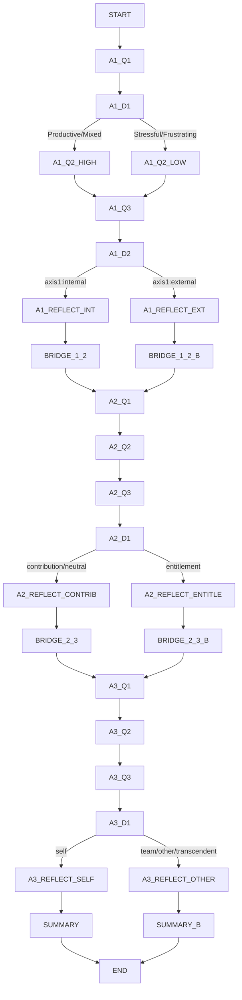

```mermaid
graph TD

%% ───────────── START ─────────────
START --> A1_Q1

%% ───────────── AXIS 1 ─────────────
A1_Q1 --> A1_D1

A1_D1 -->|Productive/Mixed| A1_Q2_HIGH
A1_D1 -->|Stressful/Frustrating| A1_Q2_LOW

A1_Q2_HIGH --> A1_Q3
A1_Q2_LOW --> A1_Q3

A1_Q3 --> A1_D2

A1_D2 -->|axis1:internal| A1_REFLECT_INT
A1_D2 -->|axis1:external| A1_REFLECT_EXT

A1_REFLECT_INT --> BRIDGE_1_2
A1_REFLECT_EXT --> BRIDGE_1_2_B

BRIDGE_1_2 --> A2_Q1
BRIDGE_1_2_B --> A2_Q1


%% ───────────── AXIS 2 ─────────────
A2_Q1 --> A2_Q2 --> A2_Q3

A2_Q3 --> A2_D1

A2_D1 -->|contribution/neutral| A2_REFLECT_CONTRIB
A2_D1 -->|entitlement| A2_REFLECT_ENTITLE

A2_REFLECT_CONTRIB --> BRIDGE_2_3
A2_REFLECT_ENTITLE --> BRIDGE_2_3_B

BRIDGE_2_3 --> A3_Q1
BRIDGE_2_3_B --> A3_Q1


%% ───────────── AXIS 3 ─────────────
A3_Q1 --> A3_Q2 --> A3_Q3

A3_Q3 --> A3_D1

A3_D1 -->|self| A3_REFLECT_SELF
A3_D1 -->|team/other/transcendent| A3_REFLECT_OTHER


%% ───────────── SUMMARY ─────────────
A3_REFLECT_SELF --> SUMMARY
A3_REFLECT_OTHER --> SUMMARY_B

SUMMARY --> END
SUMMARY_B --> END
```
